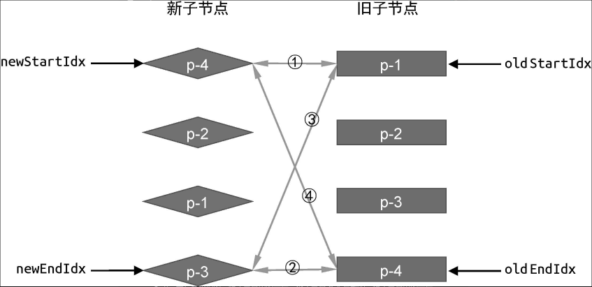
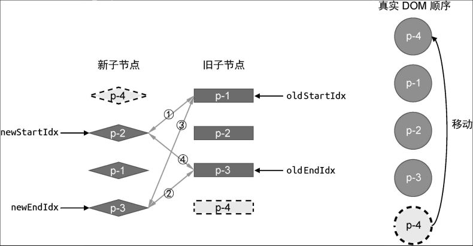
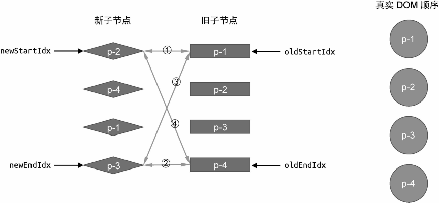

# 10. 双端 Diff 算法

双端 Diff 算法是一种同时对新旧两组子节点的两个端点进行比较的算法

### 10.1 　双端比较的原理



对于可复用的 DOM 节点，我们只需要通过 DOM 移动操作完成更新即可。只需**将索引 `oldEndIdx` 指向的虚拟节点所对应的真实 DOM 移动到索引 `oldStartIdx` 指向的虚拟节点所对应的真实 DOM 前面**


```js
function patchChildren(n1, n2, container) {
  if (typeof n2.children === "string") {
    // 省略部分代码
  } else if (Array.isArray(n2.children)) {
    // 封装 patchKeyedChildren 函数处理两组子节点
    patchKeyedChildren(n1, n2, container);
  } else {
    // 省略部分代码
  }
}

function patchKeyedChildren(n1, n2, container) {
  const oldChildren = n1.children;
  const newChildren = n2.children;
  // 四个索引值
  let oldStartIdx = 0;
  let oldEndIdx = oldChildren.length - 1;
  let newStartIdx = 0;
  let newEndIdx = newChildren.length - 1;
  // 四个索引指向的 vnode 节点
  let oldStartVNode = oldChildren[oldStartIdx];
  let oldEndVNode = oldChildren[oldEndIdx];
  let newStartVNode = newChildren[newStartIdx];
  let newEndVNode = newChildren[newEndIdx];

  while (oldStartIdx <= oldEndIdx && newStartIdx <= newEndIdx) {
    if (oldStartVNode.key === newStartVNode.key) {
      // 步骤一：oldStartVNode 和 newStartVNode 比较
    } else if (oldEndVNode.key === newEndVNode.key) {
      // 步骤二：oldEndVNode 和 newEndVNode 比较
    } else if (oldStartVNode.key === newEndVNode.key) {
      // 步骤三：oldStartVNode 和 newEndVNode 比较
    } else if (oldEndVNode.key === newStartVNode.key) {
      // 步骤四：oldEndVNode 和 newStartVNode 比较
      // 仍然需要调用 patch 函数进行打补丁
      patch(oldEndVNode, newStartVNode, container);
      // 移动 DOM 操作
      // oldEndVNode.el 移动到 oldStartVNode.el 前面
      insert(oldEndVNode.el, container, oldStartVNode.el);

      // 移动 DOM 完成后，更新索引值，指向下一个位置
      oldEndVNode = oldChildren[--oldEndIdx];
      newStartVNode = newChildren[++newStartIdx];
    }
  }
}
```

如果两者的 key 值相同，可以复用。两者都处于尾部，则不需要对真实 DOM 进行移动操作，只需要打补丁即可,参考上图第 2 步

```js
while (oldStartIdx <= oldEndIdx && newStartIdx <= newEndIdx) {
  if (oldStartVNode.key === newStartVNode.key) {
    // 步骤一：oldStartVNode 和 newStartVNode 比较
  } else if (oldEndVNode.key === newEndVNode.key) {
    // 步骤二：oldEndVNode 和 newEndVNode 比较
    // 节点在新的顺序中仍然处于尾部，不需要移动，但仍需打补丁
    patch(oldEndVNode, newEndVNode, container);
    // 更新索引和头尾部节点变量
    oldEndVNode = oldChildren[--oldEndIdx];
    newEndVNode = newChildren[--newEndIdx];
  } else if (oldStartVNode.key === newEndVNode.key) {
    // 步骤三：oldStartVNode 和 newEndVNode 比较
  } else if (oldEndVNode.key === newStartVNode.key) {
    // 步骤四：oldEndVNode 和 newStartVNode 比较
    patch(oldEndVNode, newStartVNode, container);
    insert(oldEndVNode.el, container, oldStartVNode.el);
    oldEndVNode = oldChildren[--oldEndIdx];
    newStartVNode = newChildren[++newStartIdx];
  }
}
```

4 个步骤的代码如下：

```js
while (oldStartIdx <= oldEndIdx && newStartIdx <= newEndIdx) {
  if (oldStartVNode.key === newStartVNode.key) {
    // 调用 patch 函数在 oldStartVNode 与 newStartVNode 之间打补丁
    patch(oldStartVNode, newStartVNode, container);
    // 更新相关索引，指向下一个位置
    oldStartVNode = oldChildren[++oldStartIdx];
    newStartVNode = newChildren[++newStartIdx];
  } else if (oldEndVNode.key === newEndVNode.key) {
    patch(oldEndVNode, newEndVNode, container);
    oldEndVNode = oldChildren[--oldEndIdx];
    newEndVNode = newChildren[--newEndIdx];
  } else if (oldStartVNode.key === newEndVNode.key) {
    patch(oldStartVNode, newEndVNode, container);
    insert(oldStartVNode.el, container, oldEndVNode.el.nextSibling);

    oldStartVNode = oldChildren[++oldStartIdx];
    newEndVNode = newChildren[--newEndIdx];
  } else if (oldEndVNode.key === newStartVNode.key) {
    patch(oldEndVNode, newStartVNode, container);
    insert(oldEndVNode.el, container, oldStartVNode.el);

    oldEndVNode = oldChildren[--oldEndIdx];
    newStartVNode = newChildren[++newStartIdx];
  }
}
```

### 10.2 　 双端比较的优势

对于第九章的例子，采用简单 Diff 算法需要两次 DOM 移动操作才能完成更新，而使用双端 Diff 算法只需要一次 DOM 移动操作即可完成更新。双端 Diff 算法的优势在于，对于同样的更新场景，执行的 DOM 移动操作次数更少

### 10.3 　 非理想状况的处理方式

实际上，并非所有情况都这么理想，比如


```js
while (oldStartIdx <= oldEndIdx && newStartIdx <= newEndIdx) {
  if (oldStartVNode.key === newStartVNode.key) {
    // 省略部分代码
  } else if (oldEndVNode.key === newEndVNode.key) {
    // 省略部分代码
  } else if (oldStartVNode.key === newEndVNode.key) {
    // 省略部分代码
  } else if (oldEndVNode.key === newStartVNode.key) {
    // 省略部分代码
  } else {
    // 遍历旧 children，试图寻找与 newStartVNode 拥有相同 key 值的元素
    // idxInOld 就是新的一组子节点的头部节点在旧的一组子节点中的索引
    const idxInOld = oldChildren.findIndex(
      (node) => node.key === newStartVNode.key
    );
    // idxInOld 大于 0，说明找到了可复用的节点，并且需要将其对应的真实 DOM 移动到头部
    if (idxInOld > 0) {
      // idxInOld 位置对应的 vnode 就是需要移动的节点
      const vnodeToMove = oldChildren[idxInOld];
      // 不要忘记除移动操作外还应该打补丁
      patch(vnodeToMove, newStartVNode, container);
      // 将 vnodeToMove.el 移动到头部节点 oldStartVNode.el 之前，因此使用后者作为锚点
      insert(vnodeToMove.el, container, oldStartVNode.el);
      // 由于位置 idxInOld 处的节点所对应的真实 DOM 已经移动到了别处，因此将其设置为 undefined
      oldChildren[idxInOld] = undefined;
      // 最后更新 newStartIdx 到下一个位置
      newStartVNode = newChildren[++newStartIdx];
    }
  }
}
```

如果遇到 `undefined` 节点说明该节点已经移动到了别处，因此直接跳过该节点。

```js
while (oldStartIdx <= oldEndIdx && newStartIdx <= newEndIdx) {
  // 增加两个判断分支，如果头尾部节点为 undefined，则说明该节点已经被处理过了，直接跳到下一个位置
  if (!oldStartVNode) {
    oldStartVNode = oldChildren[++oldStartIdx];
  } else if (!oldEndVNode) {
    oldEndVNode = oldChildren[--oldEndIdx];
  } else if (oldStartVNode.key === newStartVNode.key) {
    // 省略部分代码
  } else if (oldEndVNode.key === newEndVNode.key) {
    // 省略部分代码
  } else if (oldStartVNode.key === newEndVNode.key) {
    // 省略部分代码
  } else if (oldEndVNode.key === newStartVNode.key) {
    // 省略部分代码
  } else {
    const idxInOld = oldChildren.findIndex(
      (node) => node.key === newStartVNode.key
    );
    if (idxInOld > 0) {
      const vnodeToMove = oldChildren[idxInOld];
      patch(vnodeToMove, newStartVNode, container);
      insert(vnodeToMove.el, container, oldStartVNode.el);
      oldChildren[idxInOld] = undefined;
      newStartVNode = newChildren[++newStartIdx];
    }
  }
}
```

### 10.4 　添加新元素

```js
while (oldStartIdx <= oldEndIdx && newStartIdx <= newEndIdx) {
  // 增加两个判断分支，如果头尾部节点为 undefined，则说明该节点已经被处理过了，直接跳到下一个位置
  if (!oldStartVNode) {
    oldStartVNode = oldChildren[++oldStartIdx];
  } else if (!oldEndVNode) {
    oldEndVNode = newChildren[--oldEndIdx];
  } else if (oldStartVNode.key === newStartVNode.key) {
    // 省略部分代码
  } else if (oldEndVNode.key === newEndVNode.key) {
    // 省略部分代码
  } else if (oldStartVNode.key === newEndVNode.key) {
    // 省略部分代码
  } else if (oldEndVNode.key === newStartVNode.key) {
    // 省略部分代码
  } else {
    const idxInOld = oldChildren.findIndex(
      (node) => node.key === newStartVNode.key
    );
    if (idxInOld > 0) {
      const vnodeToMove = oldChildren[idxInOld];
      patch(vnodeToMove, newStartVNode, container);
      insert(vnodeToMove.el, container, oldStartVNode.el);
      oldChildren[idxInOld] = undefined;
    } else {
      // 将 newStartVNode 作为新节点挂载到头部，使用当前头部节点 oldStartVNode.el 作为锚点
      patch(null, newStartVNode, container, oldStartVNode.el);
    }
    newStartVNode = newChildren[++newStartIdx];
  }
}

// 循环结束后检查索引值的情况，
if (oldEndIdx < oldStartIdx && newStartIdx <= newEndIdx) {
  // 如果满足条件，则说明有新的节点遗留，需要挂载它们
  for (let i = newStartIdx; i <= newEndIdx; i++) {
    patch(null, newChildren[i], container, oldStartVNode.el);
  }
}
```

### 10.4 　移除不存在的元素

```js
while (oldStartIdx <= oldEndIdx && newStartIdx <= newEndIdx) {
  // 省略部分代码
}

if (oldEndIdx < oldStartIdx && newStartIdx <= newEndIdx) {
  // 添加新节点
  // 省略部分代码
} else if (newEndIdx < newStartIdx && oldStartIdx <= oldEndIdx) {
  // 移除操作
  for (let i = oldStartIdx; i <= oldEndIdx; i++) {
    unmount(oldChildren[i]);
  }
}
```
