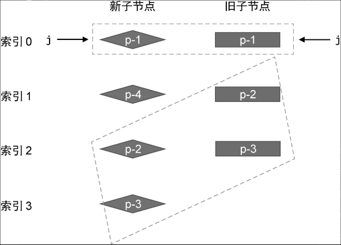
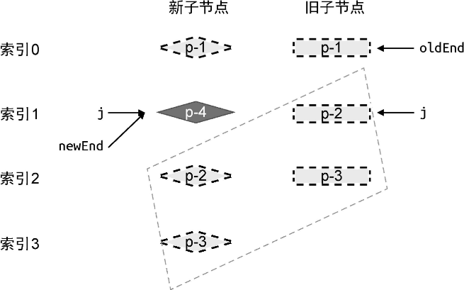

# 11. 快速 Diff 算法

快速 Diff 算法包含预处理步骤，这其实是借鉴了纯文本 Diff 算法的思路。

### 11.1 　相同的前置元素和后置元素

对于相同的前置节点和后置节点，由于它们在新旧两组子节点中的相对位置不变，所以我们无须移动它们，但仍然需要在它们之间打补丁。


当相同的前置节点和后置节点被处理完毕后，旧的一组子节点已经全部被处理了，而在新的一组子节点中，遗留的未被处理的节点就是需要新增的节点。反之新的一组子节点已经全部被处理了，在旧的一组子节点中，遗留的未被处理的节点就是需要卸载的节点


```js
function patchKeyedChildren(n1, n2, container) {
  const newChildren = n2.children;
  const oldChildren = n1.children;
  // 1. 处理相同的前置节点
  // 索引 j 指向新旧两组子节点的开头
  let j = 0;
  let oldVNode = oldChildren[j];
  let newVNode = newChildren[j];
  // while 循环向后遍历，直到遇到拥有不同 key 值的节点为止
  while (oldVNode.key === newVNode.key) {
    // 调用 patch 函数进行更新
    patch(oldVNode, newVNode, container);
    // 更新索引 j，让其递增
    j++;
    oldVNode = oldChildren[j];
    newVNode = newChildren[j];
  }
  // 2. 更新相同的后置节点
  // 索引 oldEnd 指向旧的一组子节点的最后一个节点
  let oldEnd = oldChildren.length - 1;
  // 索引 newEnd 指向新的一组子节点的最后一个节点
  let newEnd = newChildren.length - 1;

  oldVNode = oldChildren[oldEnd];
  newVNode = newChildren[newEnd];

  // while 循环从后向前遍历，直到遇到拥有不同 key 值的节点为止
  while (oldVNode.key === newVNode.key) {
    // 调用 patch 函数进行更新
    patch(oldVNode, newVNode, container);
    // 递减 oldEnd 和 nextEnd
    oldEnd--;
    newEnd--;
    oldVNode = oldChildren[oldEnd];
    newVNode = newChildren[newEnd];
  }

  // 3. 处理中间节点
  if (j > oldEnd && j <= newEnd) {
    // 锚点的索引
    const anchorIndex = newEnd + 1;
    // 锚点元素
    const anchor =
      anchorIndex < newChildren.length ? newChildren[anchorIndex].el : null;
    // 采用 while 循环，调用 patch 函数逐个挂载新增节点
    while (j <= newEnd) {
      patch(null, newChildren[j++], container, anchor);
    }
  } else if (j > newEnd && j <= oldEnd) {
    // j -> oldEnd 之间的节点应该被卸载
    while (j <= oldEnd) {
      unmount(oldChildren[j++]);
    }
  }
}
```

### 11.2 　判断是否需要进行 DOM 移动操作

```js
if (j > oldEnd && j <= newEnd) {
  // 省略部分代码
} else if (j > newEnd && j <= oldEnd) {
  // 省略部分代码
} else {
  // 构造 source 数组
  const count = newEnd - j + 1;
  const source = new Array(count);
  source.fill(-1);

  const oldStart = j;
  const newStart = j;
  let moved = false;
  let pos = 0;
  const keyIndex = {};
  for (let i = newStart; i <= newEnd; i++) {
    keyIndex[newChildren[i].key] = i;
  }
  // 新增 patched 变量，代表更新过的节点数量
  let patched = 0;
  for (let i = oldStart; i <= oldEnd; i++) {
    oldVNode = oldChildren[i];
    // 如果更新过的节点数量小于等于需要更新的节点数量，则执行更新
    if (patched <= count) {
      const k = keyIndex[oldVNode.key];
      if (typeof k !== "undefined") {
        newVNode = newChildren[k];
        patch(oldVNode, newVNode, container);
        // 每更新一个节点，都将 patched 变量 +1
        patched++;
        source[k - newStart] = i;
        // 是否需要移动
        if (k < pos) {
          moved = true;
        } else {
          pos = k;
        }
      } else {
        // 没找到
        unmount(oldVNode);
      }
    } else {
      // 如果更新过的节点数量大于需要更新的节点数量，则卸载多余的节点
      unmount(oldVNode);
    }
  }
}
```

```js

```

。。。
