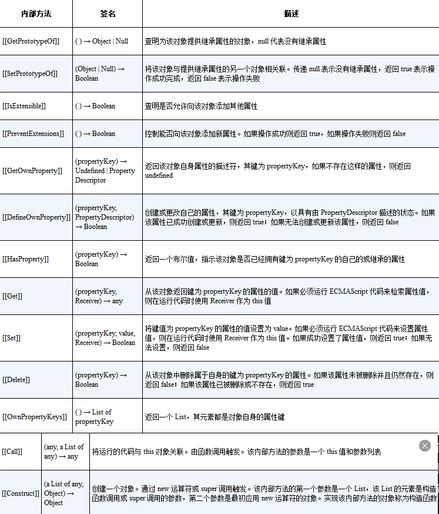
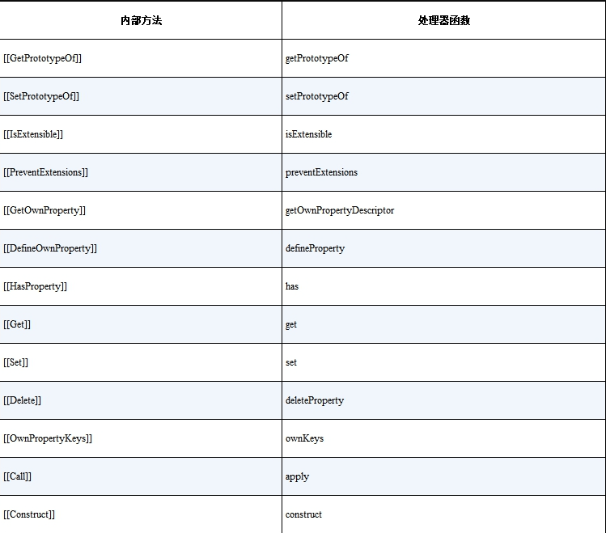

# 5. 非原始值的响应式方案

### 5.1 　理解 Proxy 和 Reflect

#### Proxy

什么是 `Proxy` 呢？使用 `Proxy` 可以创建一个代理对象（只能代理对象）。代理指的是什么呢？所谓代理，指的是对一个对象基本语义的代理。它允许我们拦截并重新定义对一个对象的**基本操作**。

```js
obj.foo; // 读取属性 foo 的值
obj.foo++; // 读取和设置属性 foo 的值
```

```js
const p = new Proxy(obj, {
  // 拦截读取属性操作
  get() {
    /*...*/
  },
  // 拦截设置属性操作
  set() {
    /*...*/
  },
});
```

类似这种读取、设置属性值的操作，就属于基本语义的操作，即基本操作。既然是基本操作，那么它就可以使用 `Proxy` 拦截。

那么，什么是非基本操作（复合操作）呢？其实调用对象下的方法就是典型的非基本操作。
拿 `obj.fn()`来说，第一个基本语义是 `get`，即先通过 `get` 操作得到 `obj.fn`属性。第二个基本语义是函数调用，即通过 `get` 得到 `obj.fn` 的值后再调用它

#### Reflect

任何在 `Proxy` 的拦截器中能够找到的方法，都能够在 `Reflect` 中找到同名函数，
拿 `Reflect.get` 函数来说,它还能接收第三个参数，即指定接收者 `receiver`，可以把它理解为函数调用过程中的 `this`

```js
const obj = { foo: 1 };
console.log(Reflect.get(obj, "foo", { foo: 2 })); // 输出2
```

分析如下代码

```js
const obj = {
  foo: 1,
  get bar() {
    return this.foo;
  },
};

const p = new Proxy(obj, {
  get(target, key) {
    track(target, key);
    // 这里没有使用 Reflect.get 完成读取
    return target[key];
  },
  set(target, key, newVal) {
    // 这里同样没有使用 Reflect.set 完成设置
    target[key] = newVal;
    trigger(target, key);
  },
});

effect(() => {
  console.log(p.bar); // 1
});
```

在 `get` 拦截函数内，通过 `target[key]` 返回属性值。其中 `target` 是原始对象 `obj`，而 `key` 就是字符串 `'bar'`，所以 `target[key]` 相当于 `obj.bar`。因此，当我们使用 `p.bar` 访问 `bar` 属性时，它的 `getter` 函数内的 `this` 指向的其实是原始对象 `obj`，这说明我们最终访问的其实是 `obj.foo`
相当于

```js
effect(() => {
  // obj 是原始数据，不是代理对象，这样的访问不能够建立响应联系
  obj.foo;
});
```

解决

```js
const p = new Proxy(obj, {
  // 拦截读取操作，接收第三个参数 receiver
  get(target, key, receiver) {
    track(target, key);
    // 使用 Reflect.get 返回读取到的属性值
    return Reflect.get(target, key, receiver);
  },
  // 省略部分代码
});
```

### 5.2 　 JavaScript 对象及 Proxy 的工作原理

在 JavaScript 中，对象的实际语义是由对象的内部方法（internal method）指定的。所谓内部方法，指的是当我们对一个对象进行操作时在引擎内部调用的方法，这些方法对于 JavaScript 使用者来说是不可见的，一个对象必须部署 11 个必要的内部方法，还有两个额外的必要内部方法：​`[​[Call]​]` 和`[​[Construct]​]`​，如果一个对象需要作为函数调用，那么这个对象就必须部署内部方法 `[​[Call]​]`​。


如果在创建代理对象时没有指定对应的拦截函数，例如没有指定 `get()` 拦截函数，那么当我们通过代理对象访问属性值时，代理对象的内部方法 `[​[Get]​]` 会调用原始对象的内部方法 `[​[Get]​]` 来获取属性值，创建代理对象时指定的拦截函数，实际上是用来自定义代理对象本身的内部方法和行为的，而不是用来指定被代理对象的内部方法和行为的


### 5.3 　如何代理 Object

#### 响应系统应该拦截的操作

| 对象操作方式   | 实现方法       |
| -------------- | -------------- |
| obj.foo        | get            |
| key in obj     | has            |
| for...in       | ownKeys        |
| obj.foo = xx   | set            |
| delete obj.foo | deleteProperty |

```js
const obj = { foo: 1 };
const ITERATE_KEY = Symbol();

const p = new Proxy(obj, {
  get(target, key, receiver) {
    // 建立联系
    track(target, key);
    // 返回属性值
    return Reflect.get(target, key, receiver);
  },

  has(target, key) {
    track(target, key);
    return Reflect.has(target, key);
  },
});
```

##### for in 循环

当为 `p` 添加属性时，应该触发与 `ITERATE_KEY` 相关联的副作用函数重新执行

```js
const obj = { foo: 1 };
const p = new Proxy(obj, {
  ownKeys(target) {
    // 将副作用函数与 ITERATE_KEY 关联
    // 因为 ownKeys 不与任何 key 关联
    track(target, ITERATE_KEY);
    return Reflect.ownKeys(target);
  },
});

effect(() => {
  // for...in 循环
  for (const key in p) {
    console.log(key); // foo
  }
});

function trigger(target, key) {
  const depsMap = bucket.get(target);
  if (!depsMap) return;
  // 取得与 key 相关联的副作用函数
  const effects = depsMap.get(key);
  // 取得与 ITERATE_KEY 相关联的副作用函数
  const iterateEffects = depsMap.get(ITERATE_KEY);

  const effectsToRun = new Set();
  // 将与 key 相关联的副作用函数添加到 effectsToRun
  effects &&
    effects.forEach((effectFn) => {
      if (effectFn !== activeEffect) {
        effectsToRun.add(effectFn);
      }
    });
  // 将与 ITERATE_KEY 相关联的副作用函数也添加到 effectsToRun
  iterateEffects &&
    iterateEffects.forEach((effectFn) => {
      if (effectFn !== activeEffect) {
        effectsToRun.add(effectFn);
      }
    });

  effectsToRun.forEach((effectFn) => {
    if (effectFn.options.scheduler) {
      effectFn.options.scheduler(effectFn);
    } else {
      effectFn();
    }
  });
}
```

##### set

当修改属性值时不会对 `for...in` 循环产生影响，不需要触发副作用函数重新执行，否则会造成不必要的性能开销。无论是添加新属性，还是修改已有的属性值，我们都是通过 `set` 拦截函数来实现拦截的

```js
const p = new Proxy(obj, {
  // 拦截设置操作
  set(target, key, newVal, receiver) {
    // 如果属性不存在，则说明是在添加新属性，否则是设置已有属性
    const type = Object.prototype.hasOwnProperty.call(target, key)
      ? "SET"
      : "ADD";

    // 设置属性值
    const res = Reflect.set(target, key, newVal, receiver);

    // 将 type 作为第三个参数传递给 trigger 函数
    trigger(target, key, type);

    return res;
  },
  // 省略其他拦截函数
});

// 将操作类型封装为一个枚举值
/* const TriggerType = {
  SET: "SET",
  ADD: "ADD",
}; */

function trigger(target, key, type) {
  const depsMap = bucket.get(target);
  if (!depsMap) return;
  const effects = depsMap.get(key);

  const effectsToRun = new Set();
  effects &&
    effects.forEach((effectFn) => {
      if (effectFn !== activeEffect) {
        effectsToRun.add(effectFn);
      }
    });

  console.log(type, key);
  // 只有当操作类型为 'ADD' 时，才触发与 ITERATE_KEY 相关联的副作用函数重新执行
  if (type === "ADD") {
    const iterateEffects = depsMap.get(ITERATE_KEY);
    iterateEffects &&
      iterateEffects.forEach((effectFn) => {
        if (effectFn !== activeEffect) {
          effectsToRun.add(effectFn);
        }
      });
  }

  effectsToRun.forEach((effectFn) => {
    if (effectFn.options.scheduler) {
      effectFn.options.scheduler(effectFn);
    } else {
      effectFn();
    }
  });
}
```

##### delete

```js
const p = new Proxy(obj, {
  deleteProperty(target, key) {
    // 检查被操作的属性是否是对象自己的属性
    const hadKey = Object.prototype.hasOwnProperty.call(target, key);
    // 使用 Reflect.deleteProperty 完成属性的删除
    const res = Reflect.deleteProperty(target, key);

    if (res && hadKey) {
      // 只有当被删除的属性是对象自己的属性并且成功删除时，才触发更新
      trigger(target, key, "DELETE");
    }

    return res;
  },
});

function trigger(target, key, type) {
  const depsMap = bucket.get(target);
  if (!depsMap) return;
  const effects = depsMap.get(key);

  const effectsToRun = new Set();
  effects &&
    effects.forEach((effectFn) => {
      if (effectFn !== activeEffect) {
        effectsToRun.add(effectFn);
      }
    });

  // 当操作类型为 ADD 或 DELETE 时，需要触发与 ITERATE_KEY 相关联的副作用函数重新执行
  if (type === "ADD" || type === "DELETE") {
    const iterateEffects = depsMap.get(ITERATE_KEY);
    iterateEffects &&
      iterateEffects.forEach((effectFn) => {
        if (effectFn !== activeEffect) {
          effectsToRun.add(effectFn);
        }
      });
  }

  effectsToRun.forEach((effectFn) => {
    if (effectFn.options.scheduler) {
      effectFn.options.scheduler(effectFn);
    } else {
      effectFn();
    }
  });
}
```

### 5.4 　合理地触发响应

##### 设置新的值时，如果值没发生变化，则不需要触发响应

```js
const p = new Proxy(obj, {
  set(target, key, newVal, receiver) {
    // 先获取旧值
    const oldVal = target[key];

    const type = Object.prototype.hasOwnProperty.call(target, key)
      ? "SET"
      : "ADD";
    const res = Reflect.set(target, key, newVal, receiver);
    // 比较新值与旧值，只有当它们不全等，并且不都是 NaN 的时候才触发响应
    if (oldVal !== newVal && (oldVal === oldVal || newVal === newVal)) {
      trigger(target, key, type);
    }

    return res;
  },
});
```

##### 基于从原型继承的场景

```js
// 封装代理函数
function reactive(obj) {
  return new Proxy(obj, {
    // 省略前文讲解的拦截函数
  });
}

const obj = {};
const proto = { bar: 1 };
const child = reactive(obj);
const parent = reactive(proto);
// 使用 parent 作为 child 的原型
Object.setPrototypeOf(child, parent);

effect(() => {
  console.log(child.bar); // 1
});
// 修改 child.bar 的值
child.bar = 2; // 会导致副作用函数重新执行两次
```

只有当 `receiver` 是 `target` 的代理对象时才触发更新

```js
function reactive(obj) {
  return new Proxy(obj {
    get(target, key, receiver) {
      // 代理对象可以通过 raw 属性访问原始数据
      if (key === 'raw') {
        return target
      }

      track(target, key)
      return Reflect.get(target, key, receiver)
    }，
    set(target, key, newVal, receiver) {
      const oldVal = target[key]
      const type = Object.prototype.hasOwnProperty.call(target, key) ? 'SET' : 'ADD'
      const res = Reflect.set(target, key, newVal, receiver)

      // target === receiver.raw 说明 receiver 就是 target 的代理对象
      if (target === receiver.raw) {
        if (oldVal !== newVal && (oldVal === oldVal || newVal === newVal)) {
          trigger(target, key, type)
        }
      }

      return res
    }
    // 省略其他拦截函数
  })
}
```

### 5.5 　浅响应与深响应

目前的 `reactive`直接返回结果是浅响应 还无法做到深响应。如果是对象，则递归地调用 `reactive` 函数将其包装成响应式数据并返回

```js
function reactive(obj) {
  return new Proxy(obj {
    get(target, key, receiver) {
      if (key === 'raw') {
        return target
      }

      track(target, key)
      // 得到原始值结果
      const res = Reflect.get(target, key, receiver)
      if (typeof res === 'object' && res !== null) {
        // 调用 reactive 将结果包装成响应式数据并返回
        return reactive(res)
      }
      // 返回 res
      return res
    }
    // 省略其他拦截函数
  })
}

```

封装 `createReactive` 函数，接收一个参数 `isShallow` ，代表是否为浅响应，默认为 `false` ，即非浅响应

```js
function createReactive(obj, isShallow = false) {
  return new Proxy(obj, {
    // 拦截读取操作
    get(target, key, receiver) {
      if (key === "raw") {
        return target;
      }

      const res = Reflect.get(target, key, receiver);

      track(target, key);

      // 如果是浅响应，则直接返回原始值
      if (isShallow) {
        return res;
      }

      if (typeof res === "object" && res !== null) {
        return reactive(res);
      }

      return res;
    },
    // 省略其他拦截函数
  });
}

function reactive(obj) {
  return createReactive(obj);
}
function shallowReactive(obj) {
  return createReactive(obj, true);
}
```

### 5.6 　只读和浅只读

增加第三个参数 `isReadonly` ，代表是否只读，默认为 `false` ，即非只读。修改 `set`和`deleteProperty` 拦截函数

```js
function createReactive(obj, isShallow = false, isReadonly = false) {
  return new Proxy(obj, {
    // 拦截设置操作
    set(target, key, newVal, receiver) {
      // 如果是只读的，则打印警告信息并返回
      if (isReadonly) {
        console.warn(`属性 ${key} 是只读的`);
        return true;
      }
      const oldVal = target[key];
      const type = Object.prototype.hasOwnProperty.call(target, key)
        ? "SET"
        : "ADD";
      const res = Reflect.set(target, key, newVal, receiver);
      if (target === receiver.raw) {
        if (oldVal !== newVal && (oldVal === oldVal || newVal === newVal)) {
          trigger(target, key, type);
        }
      }

      return res;
    },
    deleteProperty(target, key) {
      // 如果是只读的，则打印警告信息并返回
      if (isReadonly) {
        console.warn(`属性 ${key} 是只读的`);
        return true;
      }
      const hadKey = Object.prototype.hasOwnProperty.call(target, key);
      const res = Reflect.deleteProperty(target, key);

      if (res && hadKey) {
        trigger(target, key, "DELETE");
      }

      return res;
    },
    // 省略其他拦截函数
  });
}
```

如果一个数据是只读的则没必要为它添加响应式联系，同时深只读还需要递归调用 `readonly` 函数。修改 `get` 拦截函数如下

```js
function createReactive(obj, isShallow = false, isReadonly = false) {
  return new Proxy(obj, {
    // 拦截读取操作
    get(target, key, receiver) {
      if (key === "raw") {
        return target;
      }
      // 非只读的时候才需要建立响应联系
      if (!isReadonly) {
        track(target, key);
      }
      const res = Reflect.get(target, key, receiver);
      if (isShallow) {
        return res;
      }
      if (typeof res === "object" && res !== null) {
        // 如果数据为只读，则调用 readonly 对值进行包装
        return isReadonly ? readonly(res) : reactive(res);
      }
      return res;
    },
    // 省略其他拦截函数
  });
}

function readonly(obj) {
  return createReactive(obj, false, true);
}

function shallowReadonly(obj) {
  return createReactive(obj, true /* shallow */, true);
}
```

### 5.7 　代理数组

1. 数组的读取操作有

- 通过索引访问数组元素值：`arr[0]`​。
- 访问数组的长度：`arr.length`。
- 把数组作为对象，使用`for...in`循环遍历。
- 使用 `for...of` 迭代遍历数组。
- 数组的原型方法，如 `concat/join/every/some/find/findIndex/includes` 等

2. 数组的设置操作有

- 通过索引修改数组元素值：`arr[1] = 3`
- 修改数组长度：`arr.length = 0`。
- 数组的栈方法：`push/pop/shift/unshift`。
- 修改原数组的原型方法：`splice/fill/sort` 等

#### 5.7.1 　数组的索引与 length

在触发响应时，也应该触发与 `length` 属性相关联的副作用函数重新执行

```js
const arr = reactive(["foo"]); // 数组的原长度为 1

effect(() => {
  console.log(arr.length); // 1
});
// 设置索引 1 的值，会导致数组的长度变为 2
arr[1] = "bar";
```

```js
function createReactive(obj, isShallow = false, isReadonly = false) {
  return new Proxy(obj, {
    // 拦截设置操作
    set(target, key, newVal, receiver) {
      if (isReadonly) {
        console.warn(`属性 ${key} 是只读的`);
        return true;
      }
      const oldVal = target[key];
      // 如果属性不存在，则说明是在添加新的属性，否则是设置已有属性
      const type = Array.isArray(target)
        ? // 如果代理目标是数组，则检测被设置的索引值是否小于数组长度，
          // 如果是，则视作 SET 操作，否则是 ADD 操作
          Number(key) < target.length
          ? "SET"
          : "ADD"
        : Object.prototype.hasOwnProperty.call(target, key)
        ? "SET"
        : "ADD";

      const res = Reflect.set(target, key, newVal, receiver);
      if (target === receiver.raw) {
        if (oldVal !== newVal && (oldVal === oldVal || newVal === newVal)) {
          trigger(target, key, type);
        }
      }

      return res;
    },
  });
  // 省略其他拦截函数
}

function trigger(target, key, type) {
  const depsMap = bucket.get(target);
  if (!depsMap) return;
  // 省略部分内容

  // 当操作类型为 ADD 并且目标对象是数组时，应该取出并执行那些与 length 属性相关联的副作用函数
  if (type === "ADD" && Array.isArray(target)) {
    // 取出与 length 相关联的副作用函数
    const lengthEffects = depsMap.get("length");
    // 将这些副作用函数添加到 effectsToRun 中，待执行
    lengthEffects &&
      lengthEffects.forEach((effectFn) => {
        if (effectFn !== activeEffect) {
          effectsToRun.add(effectFn);
        }
      });
  }

  effectsToRun.forEach((effectFn) => {
    if (effectFn.options.scheduler) {
      effectFn.options.scheduler(effectFn);
    } else {
      effectFn();
    }
  });
}
```

反过来修改数组的 `length` 属性也会隐式地影响数组元素,

```js
const arr = reactive(["foo"]);

effect(() => {
  // 访问数组的第 0 个元素
  console.log(arr[0]); // foo
});
// 将数组的长度修改为 0，导致第 0 个元素被删除，因此应该触发响应
arr.length = 0;
```

当修改 `length` 属性值时，只有那些索引值大于或等于新的 `length` 属性值的元素才需要触发响应。

```js
// 代码理解一下这句话
const arr = reactive([1, 2, 3, 4]);
effect(() => {
  console.log(arr[0]);
});
arr.length = 2; // 索引为 2 和 3 的需要变化
```

```js
function createReactive(obj, isShallow = false, isReadonly = false) {
  return new Proxy(obj, {
    // 拦截设置操作
    set(target, key, newVal, receiver) {
      if (isReadonly) {
        console.warn(`属性 ${key} 是只读的`);
        return true;
      }
      const oldVal = target[key];

      const type = Array.isArray(target)
        ? Number(key) < target.length
          ? "SET"
          : "ADD"
        : Object.prototype.hasOwnProperty.call(target, key)
        ? "SET"
        : "ADD";

      const res = Reflect.set(target, key, newVal, receiver);
      if (target === receiver.raw) {
        if (oldVal !== newVal && (oldVal === oldVal || newVal === newVal)) {
          // 增加第四个参数，即触发响应的新值
          trigger(target, key, type, newVal);
        }
      }

      return res;
    },
  });
}

// 为 trigger 函数增加第四个参数，newVal，即新值
function trigger(target, key, type, newVal) {
  const depsMap = bucket.get(target);
  if (!depsMap) return;
  // 省略其他代码

  // 如果操作目标是数组，并且修改了数组的 length 属性
  if (Array.isArray(target) && key === "length") {
    // 对于索引大于或等于新的 length 值的元素，
    // 需要把所有相关联的副作用函数取出并添加到 effectsToRun 中待执行
    depsMap.forEach((effects, key) => {
      if (key >= newVal) {
        effects.forEach((effectFn) => {
          if (effectFn !== activeEffect) {
            effectsToRun.add(effectFn);
          }
        });
      }
    });
  }

  effectsToRun.forEach((effectFn) => {
    if (effectFn.options.scheduler) {
      effectFn.options.scheduler(effectFn);
    } else {
      effectFn();
    }
  });
}
```

#### 5.7.2 　遍历数组

##### for ... in

会影响 `for...in` 循环遍历数组的操作

- 添加新元素：`arr[100] = 'bar'`。
- 修改数组长度：`arr.length = 0`。
  无论是为数组添加新元素，还是直接修改数组的长度，本质上都是因为修改了数组的 `length` 属性

```js
function createReactive(obj, isShallow = false, isReadonly = false) {
  return new Proxy(obj, {
    // 省略其他拦截函数
    ownKeys(target) {
      // 如果操作目标 target 是数组，则使用 length 属性作为 key 并建立响应联系
      track(target, Array.isArray(target) ? "length" : ITERATE_KEY);
      return Reflect.ownKeys(target);
    },
  });
}
```

##### `for ... of`

迭代数组时，只需要在副作用函数与数组的长度和索引之间建立响应联系，就能够实现响应式的 `for...of` 迭代。~~（5.7.1 已实现）~~

无论是使用 `for...of` 循环，还是调用 `values` 等方法，它们都会读取数组的 `Symbol.iterator` 属性。该属性是一个 `symbol` 值，为了避免发生意外的错误，以及性能上的考虑，我们不应该在副作用函数与 `Symbol.iterator` 这类 `symbol` 值之间建立响应联系

```js
function createReactive(obj, isShallow = false, isReadonly = false) {
  return new Proxy(obj, {
    // 拦截读取操作
    get(target, key, receiver) {
      console.log("get: ", key);
      if (key === "raw") {
        return target;
      }

      // 添加判断，如果 key 的类型是 symbol，则不进行追踪
      if (!isReadonly && typeof key !== "symbol") {
        track(target, key);
      }

      const res = Reflect.get(target, key, receiver);

      if (isShallow) {
        return res;
      }

      if (typeof res === "object" && res !== null) {
        return isReadonly ? readonly(res) : reactive(res);
      }

      return res;
    },
  });
}
```

##### 5.7.3 　数组的查找方法

```js
const obj = {};
const arr = reactive([obj]);

console.log(arr.includes(arr[0])); // false
```

在`arr.includes(arr[0])`中，`arr[0]` 得到的是一个代理对象，而在 `includes` 方法内部也会通过 `arr` 访问数组元素，也得到一个代理对象，但这两个代理对象是不同的。这是因为每次调用 `reactive` 函数时都会创建一个新的代理对象 。创建一个原始对象和代理对象的映射，这样就避免了为同一个原始对象多次创建代理对象的问题

```js
// 定义一个 Map 实例，存储原始对象到代理对象的映射
const reactiveMap = new Map();

function reactive(obj) {
  // 优先通过原始对象 obj 寻找之前创建的代理对象，如果找到了，直接返回已有的代理对
  const existionProxy = reactiveMap.get(obj);
  if (existionProxy) return existionProxy;

  // 否则，创建新的代理对象
  const proxy = createReactive(obj);
  // 存储到 Map 中，从而避免重复创建
  reactiveMap.set(obj, proxy);

  return proxy;
}
```

```js
const obj = {};
const arr = reactive([obj]);

console.log(arr.includes(obj)); // false
```

`arr` 是代理对象，obj 是原始对象。所以 `arr.includes(obj)` 为 `false`，需要重写 `includes` 方法

```js
const arrayInstrumentations = {};

["includes", "indexOf", "lastIndexOf"].forEach((method) => {
  const originMethod = Array.prototype[method];
  arrayInstrumentations[method] = function (...args) {
    // this 是代理对象，先在代理对象中查找，将结果存储到 res 中
    let res = originMethod.apply(this, args);

    if (res === false || res === -1) {
      // res 为 false 说明没找到，通过 this.raw 拿到原始数组，再去其中查找，并更新 res 值
      res = originMethod.apply(this.raw, args);
    }
    // 返回最终结果
    return res;
  };
});

function createReactive(obj, isShallow = false, isReadonly = false) {
  return new Proxy(obj, {
    // 拦截读取操作
    get(target, key, receiver) {
      console.log("get: ", key);
      if (key === "raw") {
        return target;
      }
      // 如果操作的目标对象是数组，并且 key 存在于 arrayInstrumentations 上，
      // 那么返回定义在 arrayInstrumentations 上的值
      if (Array.isArray(target) && arrayInstrumentations.hasOwnProperty(key)) {
        return Reflect.get(arrayInstrumentations, key, receiver);
      }
      if (!isReadonly && typeof key !== "symbol") {
        track(target, key);
      }
      const res = Reflect.get(target, key, receiver);
      if (isShallow) {
        return res;
      }
      if (typeof res === "object" && res !== null) {
        return isReadonly ? readonly(res) : reactive(res);
      }
      return res;
    },
  });
}
```

##### 5.7.4 　隐式修改数组长度的原型方法

像`push/pop/shift/unshift/splice`这些方法会隐式地修改数组的 `length` 属性，所以需要重写这些方法

```js
// 一个标记变量，代表是否进行追踪。默认值为 true，即允许追踪
let shouldTrack = true;
// 重写数组的 push 方法
["push", "pop", "shift", "unshift", "splice"].forEach((method) => {
  // 取得原始 push 方法
  const originMethod = Array.prototype[method];
  // 重写
  arrayInstrumentations[method] = function (...args) {
    // 在调用原始方法之前，禁止追踪
    shouldTrack = false;
    // push 方法的默认行为
    let res = originMethod.apply(this, args);
    // 在调用原始方法之后，恢复原来的行为，即允许追踪
    shouldTrack = true;
    return res;
  };
});

function track(target, key) {
  // 当禁止追踪时，直接返回
  if (!activeEffect || !shouldTrack) return;
  // 省略部分代码
}
```

```js

```
