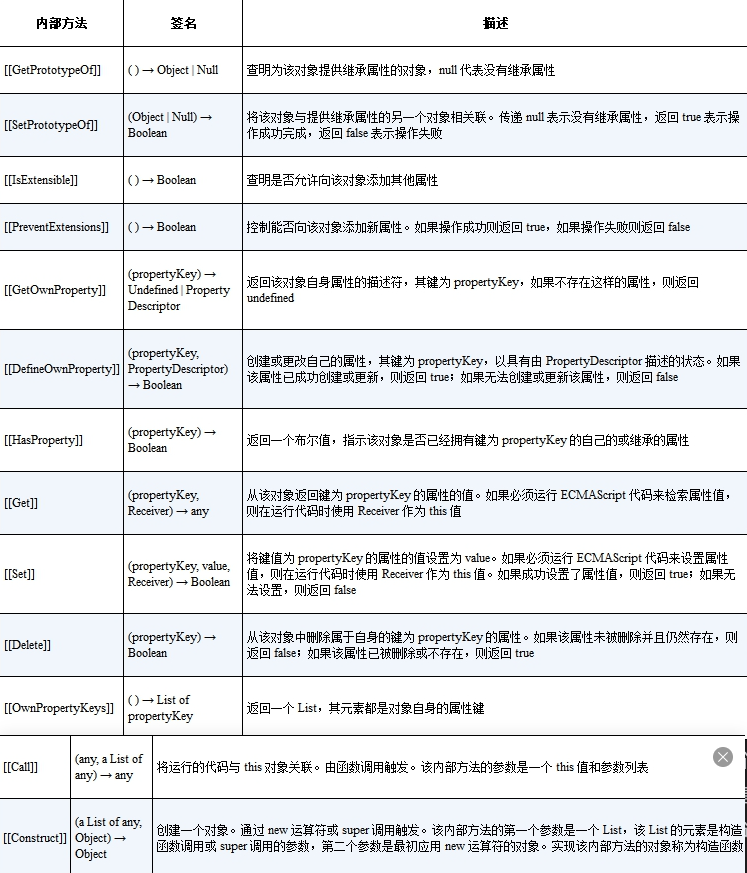

# 5. 非原始值的响应式方案

### 5.1 　理解 Proxy 和 Reflect

#### Proxy

什么是 `Proxy` 呢？使用 `Proxy` 可以创建一个代理对象（只能代理对象）。代理指的是什么呢？所谓代理，指的是对一个对象基本语义的代理。它允许我们拦截并重新定义对一个对象的**基本操作**。

```js
obj.foo; // 读取属性 foo 的值
obj.foo++; // 读取和设置属性 foo 的值
```

```js
const p = new Proxy(obj, {
  // 拦截读取属性操作
  get() {
    /*...*/
  },
  // 拦截设置属性操作
  set() {
    /*...*/
  },
});
```

类似这种读取、设置属性值的操作，就属于基本语义的操作，即基本操作。既然是基本操作，那么它就可以使用 `Proxy` 拦截。

那么，什么是非基本操作（复合操作）呢？其实调用对象下的方法就是典型的非基本操作。
拿 `obj.fn()`来说，第一个基本语义是 `get`，即先通过 `get` 操作得到 `obj.fn`属性。第二个基本语义是函数调用，即通过 `get` 得到 `obj.fn` 的值后再调用它

#### Reflect

任何在 `Proxy` 的拦截器中能够找到的方法，都能够在 `Reflect` 中找到同名函数，
拿 `Reflect.get` 函数来说,它还能接收第三个参数，即指定接收者 `receiver`，可以把它理解为函数调用过程中的 `this`

```js
const obj = { foo: 1 };
console.log(Reflect.get(obj, "foo", { foo: 2 })); // 输出2
```

分析如下代码

```js
const obj = {
  foo: 1,
  get bar() {
    return this.foo;
  },
};

const p = new Proxy(obj, {
  get(target, key) {
    track(target, key);
    // 这里没有使用 Reflect.get 完成读取
    return target[key];
  },
  set(target, key, newVal) {
    // 这里同样没有使用 Reflect.set 完成设置
    target[key] = newVal;
    trigger(target, key);
  },
});

effect(() => {
  console.log(p.bar); // 1
});
```

在 `get` 拦截函数内，通过 `target[key]` 返回属性值。其中 `target` 是原始对象 `obj`，而 `key` 就是字符串 `'bar'`，所以 `target[key]` 相当于 `obj.bar`。因此，当我们使用 `p.bar` 访问 `bar` 属性时，它的 `getter` 函数内的 `this` 指向的其实是原始对象 `obj`，这说明我们最终访问的其实是 `obj.foo`
相当于

```js
effect(() => {
  // obj 是原始数据，不是代理对象，这样的访问不能够建立响应联系
  obj.foo;
});
```

解决

```js
const p = new Proxy(obj, {
  // 拦截读取操作，接收第三个参数 receiver
  get(target, key, receiver) {
    track(target, key);
    // 使用 Reflect.get 返回读取到的属性值
    return Reflect.get(target, key, receiver);
  },
  // 省略部分代码
});
```

### 5.2 　 JavaScript 对象及 Proxy 的工作原理

在 JavaScript 中，对象的实际语义是由对象的内部方法（internal method）指定的。所谓内部方法，指的是当我们对一个对象进行操作时在引擎内部调用的方法，这些方法对于 JavaScript 使用者来说是不可见的，一个对象必须部署 11 个必要的内部方法，还有两个额外的必要内部方法：​`[​[Call]​]` 和`[​[Construct]​]`​，如果一个对象需要作为函数调用，那么这个对象就必须部署内部方法 `[​[Call]​]`​。


如果在创建代理对象时没有指定对应的拦截函数，例如没有指定 `get()` 拦截函数，那么当我们通过代理对象访问属性值时，代理对象的内部方法 `[​[Get]​]` 会调用原始对象的内部方法 `[​[Get]​]` 来获取属性值，创建代理对象时指定的拦截函数，实际上是用来自定义代理对象本身的内部方法和行为的，而不是用来指定被代理对象的内部方法和行为的


### 5.3 　如何代理 Object
